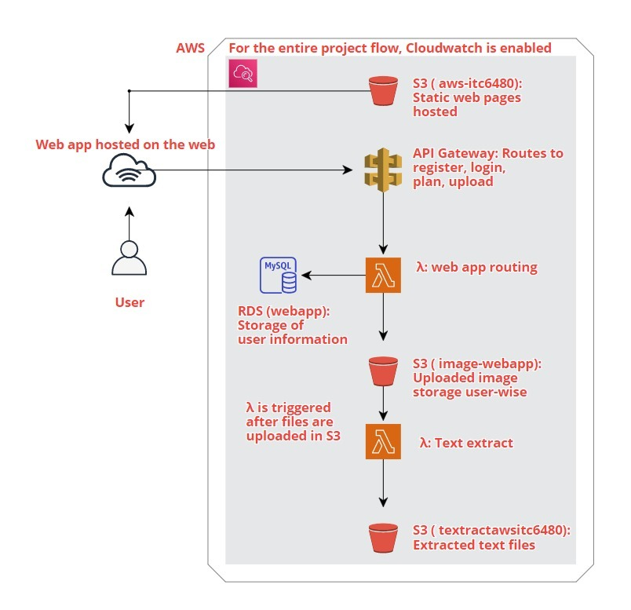
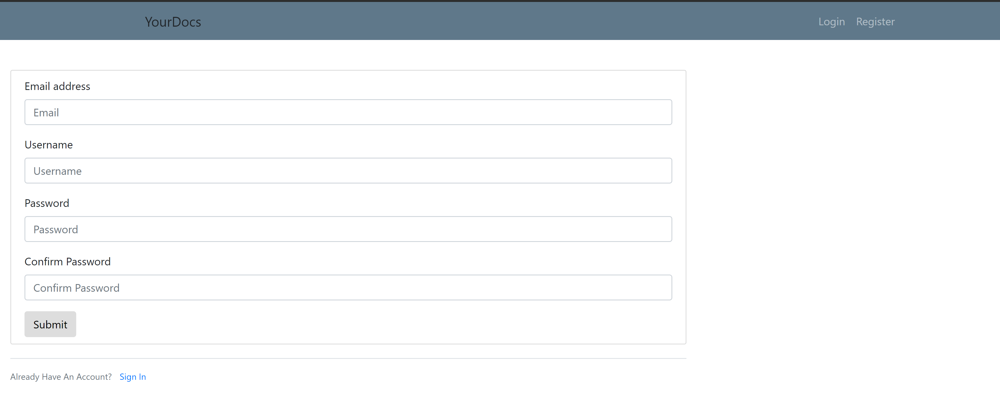
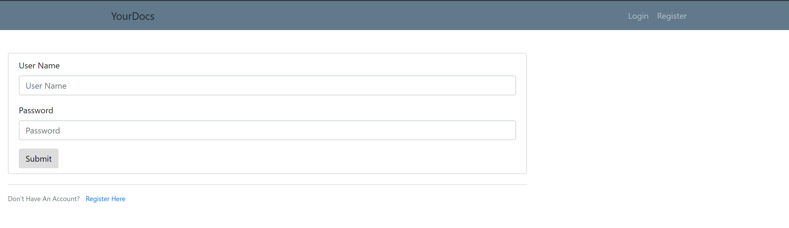
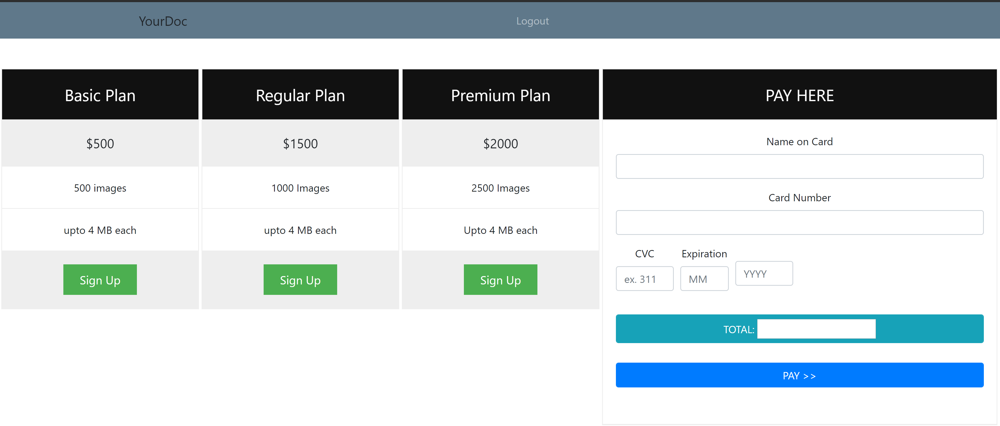
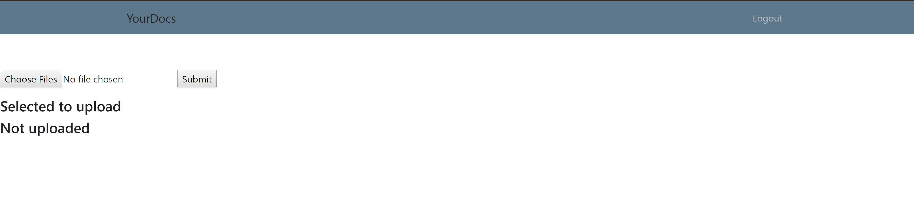

# Serverless File Upload Web Application

Our project objective is to make the build a MVP (minimal viable project) for a front end subsystem for an overall native cloud based application, which will allow file multiple file uploading and digital transformation services to registered clients. The overall application will include converting scanned documents to text and subsequently extracting the text from the images to be stored in text file. The entire service is paid for and will be completely hosted on AWS using serverless architecture.

## Requirements

This projects require you to have an AWS account and knowledge of python, HTML, Javascript, CSS, SQL and AJAX.

### Assumptions

*	Many businesses may have an existing application on server for this purpose, so we assumed that if such an application were to be moved to cloud with a serverless architecture, what steps would need to be taken and how will this transformation take place. We first built in place a Python Flask Web application and built our cloud solution around this. The Flask application has registration, login , plan and file upload modules with MySQL database for maintaining user information.
*	In this solution, we have assumed Username will be unique
*	Each registered user must have a subscription plan selected, and paid for, which will allocate the count of images each user can upload with that plan. 
*	For every subscribed user a separate folder will be maintained for the uploaded files
*	Files will only be JPEG format not more than 4MB in size

### Architecture

At a birds’ eye view, the architecture has the flow from Registration then Login, Selection of a subscription plan and uploading files. In the background, once file upload is successful, Textract is run automatically to extract text from each image document and saved in a text file. 
The AWS Services used are :

*	Amazon S3 for 3 buckets of hosting static webpages built using HTML/CSS, Javascript and AJAX, maintaining user directories and storing extracted text files
*	AWS API Gateway to handle requests and responses to the webpages
*	Amazon RDS MySQL to maintain users table in the webapp database
*	AWS Lambda functions- one triggered based on API Gateway responses and other for Textract service
*	AWS Textract to extract text from images and storing in to Text Files
*	Amazon CloudWatch to manage logs upon deployment to track progress and useful for debug

The Architectural depiction of our Serverless Web Application is shown below:

*	We have used AWS S3  service to host our web app. All the html pages are hosted in one single S3 bucket – aws-itc6480
*	The user registers himself/herself and then logins with the user-id and the password. After he logs in he is directed to the plan page wherein he can select the plan which has to be selected for the number of images to upload along with a payment service. Then after the upload page there is upload page wherein we can upload the files.
*	API gateway is used to pass request and response smoothly between the webpage and backend and lambda is used to perform the activities that happen in that page.
*	The user information like the email-id, user-id, password, plan selected, number of files remain to upload as per the plan. 
*	The uploaded images are saved in S3 bucket image-webapp by creating a new folder for each user.
*	Once the file is uploaded in S3 then a lambda getText is triggered which makes extracts the text from the image and stores in a form of a text file in another S3 bucket textractawsitc6480.

### Pages

Register page:

Login page:

Payment page:

Upload page:

## Contributing
Pull requests are welcome. For major changes, please open an issue first to discuss what you would like to change.

Please make sure to update tests as appropriate.

